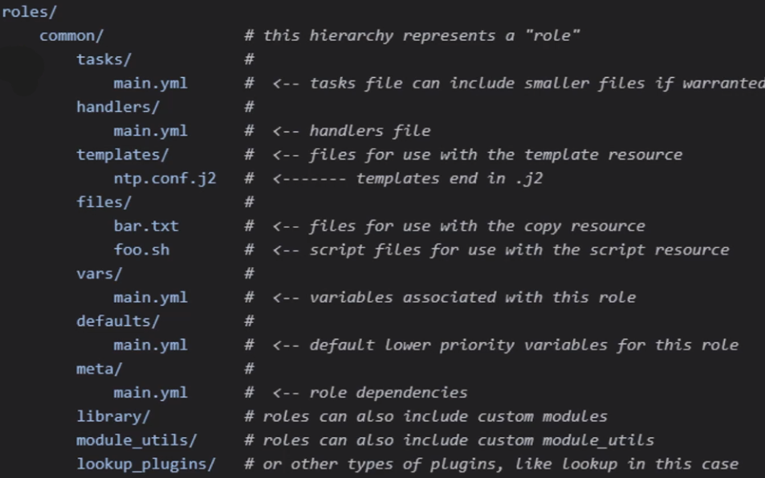
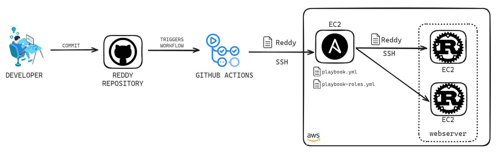

<h1 align="center" style="display: block; font-size: 2.5em; font-weight: bold; margin-block-start: 1em; margin-block-end: 1em;">
<a name="logo" href="https://docs.ansible.com/ansible/latest/index.html"></a>
  <br /><br /><strong>ANSIBLE DEMO</strong>
</h1>

<div align="center">
  
  
  
  
  
</div>

---

## Introduction [](#introduction) 

[Ansible](https://docs.ansible.com/ansible/latest/index.html) is an open-source IT automation tool that simplifies configuration management, application deployment, and infrastructure orchestration. It uses a simple declarative language based on YAML to describe the desired system configuration and automate complex tasks efficiently. Ansible is highly scalable and can manage everything from small single-server setups to large enterprise environments with thousands of nodes. Being agentless (unlike [Puppet](https://www.puppet.com/)), it doesn't require additional software on the target nodes, making deployment easy and reducing operational complexity.

## Table of contents[](#table-of-contents) 
- [Introduction ](#introduction-)
- [Table of contents](#table-of-contents)
- [Topology](#topology)
- [Quick start ](#quick-start-)
- [About the Docker containers](#about-the-docker-containers)
  - [Ansible Container (ansible-container)](#ansible-container-ansible-container)
  - [Semaphore Container (semaphore-container)](#semaphore-container-semaphore-container)
  - [Rust Container (rust-container)](#rust-container-rust-container)
  - [The remaining containers](#the-remaining-containers)
- [Inventory](#inventory)
  - [File structure](#file-structure)
    - [Host infomation](#host-infomation)
    - [Variables](#variables)
    - [Logical subgroups](#logical-subgroups)
- [Playbook](#playbook)
  - [How does a module run in the target node](#how-does-a-module-run-in-the-target-node)
  - [Playbooks in this project](#playbooks-in-this-project)
    - [Starting the Redis Instance](#starting-the-redis-instance)
    - [Running the Reddy Webserver](#running-the-reddy-webserver)
    - [Configuring Nginx as a Load Balancer](#configuring-nginx-as-a-load-balancer)
    - [Firewall configuration](#firewall-configuration)
- [Jinja 2 templates](#jinja-2-templates)
  - [Templating process](#templating-process)
  - [Usage of Jinja2 templates in this project](#usage-of-jinja2-templates-in-this-project)
- [Roles](#roles)
- [Semaphore UI](#semaphore-ui)
  - [Using Semaphore to run a playbook](#using-semaphore-to-run-a-playbook)
- [How to add a new web server ](#how-to-add-a-new-web-server-)
- [Improvements](#improvements)

## Topology[](#topology)

The toppology consists of an [NGINX](https://nginx.org/en/) acting as a load balancer for two [Rust](https://www.rust-lang.org/)-based web servers. These servers store/retrieve a key in [Redis](https://redis.io/), and if it exists, return the associated value for that key. All of this is done using HTTP requests.

The system was set up using [Docker Compose](docker-compose.yaml), allowing us to conduct local testing and, ideally, add new containers for configuration with Ansible as needed. Each of the squares would represent a [Docker container](docker-containers). All containers belong to the same network, and the public key (`id_rsa.pub`) of the Ansible container is present in the `authorized_keys` file in all containers to ensure seamless connections between them and enable task execution via SSH.

<div align="center">
    
</div>

<div align="right">[ <a href="#table-of-contents">↑ Back to top ↑</a> ]</div>

## Quick start [](#quick-start) 

In the root of the project, run docker compose. This will take a while, ~6 minutes.

```bash
$ docker-compose up -d
```
With this command, we are bringing up the aforementioned topology.

There are two ways to test Ansible, one is with the [UI](#semaphore-ui) (as we will explain later in the README) while the other, is to utilize Ansible CLI commands. In this section, we'll explain how to access the Ansible controller container and execute playbooks via the terminal.

First, we need to get a terminal operating inside `ansible-container` (see next section for more details). We can do this by running the following docker command:
```bash
$ docker exec -it ansible-container /bin/bash
root@c02102bd917f:/ansible#
```

Now that we're inside the container, we can execute Ansible commands. Before that, to be sure that Ansible does not issue any warnings about working in a [world-writable directory](https://docs.ansible.com/ansible/latest/reference_appendices/config.html#avoiding-security-risks-with-ansible-cfg-in-the-current-directory), inside the container we will run the following command

```bash
root@c02102bd917f:/ansible# chmod o-w .
```

Now that we've done that, we're interested in running playbooks, so we'll use `ansible-playbook` command. Here's the syntax:

``` bash
root@c02102bd917f:/ansible# ansible-playbook -i <inventory_file> <playbook_file>
```

or

``` bash
# This is possible due to ansible.cfg file in the root of the project
root@c02102bd917f:/ansible# ansible-playbook <playbook_file>
```

If we inspect the files in this container, we'll find that this project's `inventory.yml`, `playbook.yml` and `playbook-roles.yml` can already be found in the root folder, so to run said playbook with said inventory we can simply run:

```bash
root@c02102bd917f:/ansible# ansible-playbook -i inventory.yml playbook.yml
```

or

```bash
root@c02102bd917f:/ansible# ansible-playbook -i inventory.yml playbook-roles.yml
```

or

``` bash
# This is possible due to ansible.cfg file in the root of the project that points to inventory.yml
root@c02102bd917f:/ansible# ansible-playbook playbook.yml
```

or

``` bash
# This is possible due to ansible.cfg file in the root of the project that points to inventory.yml
root@c02102bd917f:/ansible# ansible-playbook playbook-roles.yml
```

After Ansible completes the configuration of our hosts, we'll receive a summary detailing the changes made. As both playbooks are identical, running them multiple times yields idempotent results.

We'll explain the purpose of each part of the command throughout the README.

Now, to try the project functionallity, run this commands in your host CMD or terminal:

```bash
# Post a key called "akey"
> curl -X POST http://localhost:8080/akey -d "This is the value associated with the key akey" -i
HTTP/1.1 200 OK
Server: nginx/1.24.0 (Ubuntu)
Date: Sun, 02 Jun 2024 02:40:54 GMT
Content-Length: 2
Connection: keep-alive
x-reddy-instance-name: web-server1
x-redis-instance-index: 0
X-Backend-Server: 172.16.238.7:8080

OK
```

```bash
# Retrieve the key "akey"
> curl -X GET http://localhost:8080/akey -i
HTTP/1.1 200 OK
Server: nginx/1.24.0 (Ubuntu)
Date: Sun, 02 Jun 2024 02:41:30 GMT
Content-Length: 46
Connection: keep-alive
x-reddy-instance-name: web-server1
x-redis-instance-index: 0
X-Backend-Server: 172.16.238.7:8080

This is the value associated with the key akey
```

<div align="right">[ <a href="#table-of-contents">↑ Back to top ↑</a> ]</div>


## About the Docker containers[](#docker-containers) 

### Ansible Container (ansible-container)
The [Ansible container's Dockerfile](docker-containers/ansible-container/Dockerfile) only configures Ansible and generates SSH keys. To simplify the demonstration and emphasize Ansible's functionality, a volume has been mounted on all containers at `/root/.ssh`, containing the generated private/public key pair (`id_rsa` and `id_rsa.pub`) along with an authorized_keys file containing the corresponding public key. This setup enables all target containers to allow access to Ansible nodes via SSH. Additionally, both Ansible containers (`ansible-container` and `semaphore-container`) utilize the same keys to communicate with these nodes.

### Semaphore Container (semaphore-container)
The Semaphore container is responsible for bringing up the necessary user interface to use the application. This container relies on another PostgreSQL container to persist certain information (such as playbook runs, statistics, configurations, etc).

### Rust Container (rust-container)
In this topology, we can think of the [Rust container](docker-containers/rust-container/Dockerfile) as a pipeline in GitHub Actions or Jenkins. Essentially, it fetches from the [Reddy](https://github.com/ThomasMiz/reddy) repository, compiles the Rust project (required for the topology's webservers), and, via a volume, provides the executable file named `reddy` to the ansible-container and semaphore-container for use in the playbooks and be able to deploy it.

For instance, if we had opted for AWS instead of Docker, the GitHub Actions pipeline would have employed the checkout action, compiled the project using a Rust action, and delivered the `reddy` executable to the VMs with Ansible using SSH with a specific user.

### The remaining containers
The remaining containers are [Ubuntu containers](docker-containers/ubuntu-container/Dockerfile) with OpenSSH server installed so that Ansible can connect to them. They will act as the target nodes in our inventory.

 With the explanation of the containers, now we will provide an explanation of some Ansible concepts.

<div align="right">[ <a href="#table-of-contents">↑ Back to top ↑</a> ]</div>

## Inventory[](#inventory) 
In this section, we will explain the structure and purpose of the Ansible inventory file used in the project. An Ansible inventory file is a YAML or INI file that defines the hosts and groups of hosts upon which Ansible commands, modules, and playbooks operate. The inventory file for this project can be found [here](inventory.yml).

### File structure

#### Host infomation
- The `hosts` subsection lists individual hosts with their connection information
- Each host is defined with a name and connection details
- The `ansible_host` variable specifies the address Ansible should use to connect to the host

#### Variables 
- Although not shown in this specific inventory file, the `vars` subsection can be used to define variables that apply to all hosts within the `all` group.

#### Logical subgroups
  The `children` subsection groups hosts into logical subgroups, making it easier to manage and apply tasks to related hosts collectively. There are 3 groups in the inventory file:

- **Webserver Group**
  - The `webserver` group contains hosts related to web servers.
  - Hosts in this group:
    - `web-server1`
    - `web-server2`

- **Rediservers Group**
  - The `rediservers` group contains hosts related to Redis servers.
  - Hosts in this group:
    - `redis-server1`
    - `redis-server2`

- **Loadbalancer Group**
  - The `loadbalancer` group contains hosts related to load balancers.
  - Hosts in this group:
    - `load-balancer`

<div align="right">[ <a href="#table-of-contents">↑ Back to top ↑</a> ]</div>

## Playbook[](#playbook) 

Playbooks define automation routines in a declarative manner. They specify the desired state that the target needs to achieve for a given task and are written in YAML format.

A playbook consists of one or more plays listed in order. Each play contributes to the overall goal of the playbook by executing one or more tasks. Each task invokes an Ansible module, which is a functional unit within Ansible used to enact changes in the system. Essentially, modules enforce the desired state on a remote node.

At a minimum, each play defines:

- The managed nodes to be targeted using a pattern.
- One task to be executed.

### How does a module run in the target node
<div align="center">
    
</div>

The control node establishes an SSH connection with a remote node. Following this, the control node transfers the module to the remote node. To execute the module, the control node dispatches specific arguments to the copied module. Subsequently, the module operates on the remote node, and the resulting output is captured and returned to the control node. Executing any playbook or ad-hoc Ansible command will display this output.

While not all modules follow this exact process, it provides a helpful insight into the underlying operations.

### Playbooks in this project

To enhance the explanation of the playbooks within this project, let's take a look at some parts of the main [playbook](playbook.yml). 

#### Starting the Redis Instance

This playbook ensures that the Redis server is installed, configured, and running on the target nodes.

```yml
- name: Start the redis instance
  gather_facts: no
  hosts: rediservers
  
  tasks:
    - name: Ensure redis-server service is installed
      ansible.builtin.package:
        name: redis-server
        state: present

    - name: Copy the redis.conf file into /etc/redis
      ansible.builtin.copy:
        src: ./files/redis.conf
        dest: /etc/redis/redis.conf
        owner: redis
        mode: 777
      notify: Restart redis-server service
  
  handlers:
    - name: Restart redis-server service
      ansible.builtin.service:
        name: redis-server
        state: restarted
```

This playbook ensures redis-server is installed using the `package` module, copies a pre-defined Redis configuration file to the target nodes and sets the necessary permissions. It triggers a handler to restart the Redis service using the `notify` label.

#### Running the Reddy Webserver

This playbook sets up and runs a custom webserver called "Reddy" on the target nodes.

```yml
- name: Run reddy webserver
  gather_facts: no
  hosts: webserver
  tasks:
    - name: Ensure /etc/reddy folder exists
      ansible.builtin.file:
        args:
          dest: /etc/reddy
          state: directory

    - name: Copy reddy executable
      ansible.builtin.copy:
        src: /reddy/executable/reddy
        dest: /etc/reddy/reddy
        mode: 777

    - name: Create .env file
      ansible.builtin.template:
        src: ./templates/env.j2
        dest: /etc/reddy/.env

    - name: Copy systemd service file
      ansible.builtin.copy:
        src: ./files/reddy.service
        dest: /etc/systemd/system/reddy.service
      notify:
        - Reload systemd
        - Restart reddy service
  
  handlers:
    - name: Reload systemd
      ansible.builtin.systemd:
        daemon_reload: yes

    - name: Restart reddy service
      ansible.builtin.service:
        name: reddy
        state: restarted
```

<u>Tasks</u>:
1. Ensure `/etc/reddy` folder (directory for the Reddy webserver) exists and then copies the Reddy executable file to the target nodes.
2. Create `.env` file using a template
3. Copy systemd service file: Copies a systemd service file for managing the Reddy webserver and notifies handlers to reload systemd and restart the service.

<u>Handlers</u>:
- Reload systemd: Reloads the systemd configuration to apply the new service file.
- Restart reddy service: Restarts the Reddy service to ensure it uses the latest configuration.

#### Configuring Nginx as a Load Balancer

This playbook installs and configures Nginx to function as a load balancer.

``` yml
- name: Config nginx as a load balancer
  gather_facts: no
  hosts: loadbalancer
  tasks:
    - name: install web service
      ansible.builtin.package:
        name: nginx
        state: present
        update_cache: yes
      notify: start nginx

    - name: delete default config
      ansible.builtin.file:
        path: /etc/nginx/sites-enabled/default
        state: absent
      notify: reload nginx

    - name: Configure NGINX
      ansible.builtin.template:
        src: templates/nginx_load_balancer.conf.j2
        dest: /etc/nginx/sites-available/load_balancer.conf
      notify: reload nginx

    - name: Enable NGINX loadbalancer site
      ansible.builtin.file:
        src: /etc/nginx/sites-available/load_balancer.conf
        dest: /etc/nginx/sites-enabled/load_balancer.conf
        state: link
      notify: reload nginx

  handlers:
    - name: start nginx
      ansible.builtin.service:
        name: nginx
        state: started
        enabled: yes

    - name: reload nginx
      ansible.builtin.service:
        name: nginx
        state: reloaded
```

This playbook installs `nginx` on the target nodes, then deletes the default configuration file, then copies the correct configuration file and finaly cretes the symbolic link to enable the new configuration. The handlers are in charge of starting and reloading the `nginx` service. 

#### Firewall configuration

All the target nodes start an UFW firewall that denies everithing by default, all the target nodes allow ssh connections from the ansible manager node (ansible-container) and from the semaphore node (semaphore-container). The IPs of this last two node are fixed an known. 

```yml
 - name: Start UFW service
    ansible.builtin.service:
      name: ufw
      state: started

  - name: Block everything and enable UFW
    community.general.ufw:
      state: enabled
      policy: deny

  - name: Allow SSH from specified host to webserver (ansible-container and semaphore-container)
    ansible.builtin.ufw:
      rule: allow
      port: ssh
      from_ip: "{{ item }}"
    loop:
      - 172.16.238.240
      - 172.16.238.241
```

Then different groups of target nodes define their particular firewall rules. 

The load balancer accepts `http` and `https` connections 

```yml
- name: Allow HTTP and HTTPS from loadbalancer
  ansible.builtin.ufw:
    rule: allow
    port: "{{ item }}"
  loop:
    - http
    - https
```

And the web servers accept connections only form the load balancer

```yml
- name: Gather facts from load-balancer
  ansible.builtin.setup:
    gather_subset: all
  delegate_to: load-balancer
  run_once: true
  register: load_balancer_facts

 - name: Allow requests for port 8080 from load balancers only
   ansible.builtin.ufw:
    rule: allow
    port: 8080
    from_ip: "{{ load_balancer_facts.ansible_facts['ansible_default_ipv4']['address'] }}"
```

<div align="right">[ <a href="#table-of-contents">↑ Back to top ↑</a> ]</div>

## Jinja 2 templates[](#jinja-2) 

Ansible uses Jinja 2 templating to enable dynamic expressions and access variables and facts (parametrization).  This avoids hardcoding values inside templates

Usually templates are stores in the ```templates``` module. For example, you can create a template for a configuration file, then deploy that configuration file to multiple environments and supply the correct data (IP Address, hostname, version) for each environment.

All templating happens on the ansible control node before the task is sent and executed on the target machine. This approach minimize the package requirements on the target (Jinja 2 is only required in the control node). It also limits the amount of data Ansible passes to the target machine. Ansible parses templates on the control node and passes only the information needed for each task to the target machine, instead of passing all the data on the control node and parsing it on the target.

### Templating process

The image illustrates the process of templating in Ansible using Jinja2:

<div align="center">
    
</div>

1. **Template**: The initial template file, typically stored in the `templates` directory.
2. **J2 Engine**: The Jinja2 templating engine processes the template file on the Ansible control node.
3. **Rendered Template**: The processed template with all variables and expressions evaluated and replaced.
4. **Copy**: The rendered template is then copied to the target nodes (e.g., Node 1 and Node 2) for execution.

### Usage of Jinja2 templates in this project

Below is an example of how Jinja2 is used to dynamically add web servers in the NGINX configuration file. This example demonstrates how you can use a Jinja2 template to iterate over a group of web servers and configure them for load balancing. This aproach allows to add new web servers without changing the templates, it is not necessary to know the server's IPs, nor how many of them are being used:

```jinja
upstream app_servers {
    
    server {{ hostvars[server]['ansible_host'] }}:8080 weight=1;
    
}

server {
    listen 80;

    location / {
        proxy_pass http://app_servers;
        proxy_set_header Host $host;
        proxy_set_header X-Real-IP $remote_addr;
        proxy_set_header X-Forwarded-For $proxy_add_x_forwarded_for;
        add_header X-Backend-Server $upstream_addr;
    }
}
```

In this template:

- In the `upstream app_servers` block servers are dynamically added from the `webserver` group.
- The `for` loop iterates over each server in the `webserver` group.
- `hostvars[server]['ansible_host']` is used to get the IP address of each server.
- The resulting configuration sets up load balancing for the NGINX server with the dynamically generated list of backend servers.

Jinja2 template is also used to configure the `.env` environment files for the Reddy web servers. This template is part of a larger Ansible task that sets up the environment for each web server:

```jinja
LISTEN_AT=0.0.0.0:8080
INSTANCE_NAME={{ inventory_hostname }}
REDIS_HOSTS={{ groups['rediservers'] | map('regex_replace', '^(.*)$', 'redis://\\1:6379/') | join(';') }}
```

The Ansible playbook has the following task: 

```yml
- name: Create .env file
  ansible.builtin.template:
    src: ./templates/env.j2
    dest: /etc/reddy/.env
```

When the task runs, Ansible processes the `env.j2` template and replaces the `{{ inventory_hostname }}` placeholder with `web-server1` and `web-server2` for the respective hosts, as well as setting the `REDIS_HOSTS` to `redis://redis-server1:6379/;redis://redis-server2:6379/`:

- `groups['rediservers']` returns an array of strings with the inventory names of all the web servers.
- The `map` function is used to prepend each entry with `redis://` and append `:6379/`.
- Finally, each entry is `join`-ed, concatenating them together separated by a colon ';'.

<div align="right">[ <a href="#table-of-contents">↑ Back to top ↑</a> ]</div>

## Roles[](#roles)
In the realm of Ansible automation, where previously all tasks and configurations were consolidated within a single monolithic playbook called [playbook.yml](playbook.yml), the advent of roles introduces a paradigm shift towards modularity and organization. Roles represent an opportunity to break down the complexity of playbooks by encapsulating all pertinent information related to a particular task or configuration within its own distinct unit. Roles in Ansible provide a structured and efficient way to reuse and share code between different playbooks. They allow the modularization of code into smaller, specific units, such as tasks, variables, templates, files and other resources necessary for their execution. Additionally, roles may include metadata, handlers, and tests to ensure their robustness and facilitate integration. 

<div align="center">
    
</div>

Roles can be centrally managed and shared through remote registries such as [Ansible Galaxy](https://www.ansible.com/galaxy/), enabling streamlined collaboration and code reuse within the Ansible community. Ultimately, roles enhance playbook organization, provides code modularity, and facilitate efficient automation workflows. This evolution allows for a more structured and manageable approach to automation, where each role contains all the necessary components—tasks, variables, templates, and more—streamlining playbook development and enhancing overall system maintenance. Consequently, modularizing our initial playbook yields a more organized, reusable, and maintainable automation solution, [playbook-roles.yml](playbook-roles.yml).

```yml
- name: Configure nginx as load balancer
  gather_facts: no
  hosts: loadbalancer
  roles:
    - nginx-firewall
    - nginx

- name: Configure the redis instances for the webservers
  gather_facts: no
  hosts: rediservers
  roles:
    - rediservers

- name: Configure reddy project as webserver
  gather_facts: no
  hosts: webserver
  roles:
    - webserver-firewall
    - webserver
```

In short, hosts will execute specific roles listed under the label `roles`. These roles are located within the `roles` folder.

<div align="right">[ <a href="#table-of-contents">↑ Back to top ↑</a> ]</div>

## Semaphore UI[](#semaphore) 

[Semaphore UI](https://www.semui.co/) is an open-source project offering a responsive web UI for running Ansible playbooks. It simplifies workflow management by allowing users to efficiently execute tasks, organize playbooks, and manage environments, inventories, repositories, and access keys. With its mobile-friendly interface, Semaphore provides flexibility in task management, enabling users to schedule playbook runs, access detailed logs, delegate tasks, and receive notifications.

### Using Semaphore to run a playbook

Let's run a playbook using Semaphore. The service its listening in http://localhost:3000/. 


<div align="center">
    
</div>

Login with the following credentials:

```bash
username = admin
password = admin
```

Now create a new project called `ansible-demo` as shown:
<div align="center">
    
</div>

- Click on _New Project_.
- Enter `ansible-demo` as the project name.
- Leave the other fields empty and click _Create_.

Then create a repository using the link of the git repository:
<div align="center">
    
</div>

- On the navigation sidebar to the left, go to _Repositories_.
- Click the _New Repository_ button on the top-right of the screen.
- Enter `ansible-demo` as the name of the repositroy and enter the URL of this git repository, https://github.com/ThomasMiz/ansible-demo.
- On _Branch_, specify the _main_ branch.
- On _Access Key_, select _None_.
- Click on the _Create_ button.

Next, we'll create the SSH keys using the private key of the ansible-container. To get this key, we need to open a terminal within the container, then we can find the key at `/root/.ssh/id_rsa`:
```bash
$ docker exec -it ansible-container /bin/bash
root@23fa96265dde:/ansible cat /root/.ssh/id_rsa
```

And now we can enter this key into Semaphore:
<div align="center">
    
</div>

- Now on the navigation sidebar, go to _Key Store_.
- Create a new key with the button on the top-right.
- Name the key `ssh-key`.
- On _Key Type_, select _SSH Key_. This will make more options appear.
- Enter `root` as the username, but leave the passphrase blank.
- Copy and paste the container's key into the _Private Key_ textbox.

With that done, let's set up the Ansible inventory for Semaphore:
<div align="center">
    
</div>

- On the navigation sidebar, go to _Inventory_.
- Create a new inventory with the button on the top-right.
- Name the new inventory `inventory`.
- Set the user credentials to `ssh-key`.
- Leave _Sudo Credentials_ blank.
- On _Type_, select _File_. This will make more options appear.
- On _Repository_, select `ansible-demo`.
- On _Path to Inventory file_, type `inventory.yml`.

Next up, we'll configure a Semaphore environment:
<div align="center">
    
</div>

- On the navigation sidebar, go to _Environment_.
- Create a new environment with the button on the top-right.
- Enter `TESTING` as the environment name.
- Leave the other textboxes unmodified, as our playbooks don't require any additional environment variables.
- Save the environment.

And create a task for running our playbook:
<div align="center">
    
</div>

- On then navigation sidebar, go to _Task Templates_.
- Create a new task template with the button on the top-right.
- Enter "Run Playbook" as the name of the task
- Enter `playbook.yml` as the _Playbook Filename_.
- Select `ansible-demo` as the repository.
- Select `TESTING` as the environment.
- Leave all fields blank and press _Create_.

Finally, we can run the task! In _Task Templates_ we will now see our new "Run Playbook" task listed, and on the right we'll see a "RUN" button. This will open a popup allowing us to enter a message or specify some options, but we can skip this and just press "RUN".

The result should look something like this:
<div align="center">
    
</div>

<div align="right">[ <a href="#table-of-contents">↑ Back to top ↑</a> ]</div>

## How to add a new web server 

The first step is to have a host to start the web server. Another host can be added to the docker compose like this:

```yml
web-server3:
  build:
    context: ./docker-containers/ubuntu-container
    dockerfile: Dockerfile
  privileged: true
  networks:
    - common
  tty: true
  container_name: web-server3
  volumes:
    - ssh-keys:/root/.ssh
```

Also the `inventory.yaml` needs to be modified to recognize this new host:

```yml
all:
  hosts:
    web-server1:
      ansible_host: web-server1
    web-server2:
      ansible_host: web-server2
    web-server3:
      ansible_host: web-server3
    [ ... ]

 children:

    webserver:
      hosts:
        web-server1:
        web-server2:
        web-server3:

   [ ... ]
```

After doing this changes, run docker-compose to launch the new container:

```bash
$ docker-compose up -d
```

and finally run the playbook again, like explained in this [section](#running-ansible-through-the-terminal).


<div align="right">[ <a href="#table-of-contents">↑ Back to top ↑</a> ]</div>


## Improvements[](#improvements)

The initial Ansible demonstration utilized Docker for illustrative purposes. However, in practical situations, Docker might not always be the optimal choice. Therefore, we opted to focus this section on a slightly more realistic use case, albeit one that presents a bit more complexity.

<div align="center">
    
</div>

As mentioned, the team uses the Reddy project as a web server template. Suppose a developer makes changes to the project and pushes them to the remote GitHub repository. How can we automate the deployment process with Ansible so that when a change is pushed, it gets reflected on all our web servers?

The idea is to use a GitHub Actions workflow. This workflow will be inside the repository under the path `.github/workflows/deployment.yml`. This workflow will run on every push to the repository. To simplify the explanation, the workflow, using Actions from the GitHub Actions marketplace, can clone the project into the GitHub runner, compile the Rust project there, take the executable named `reddy`, connect via SSH to an EC2 instance with Ansible (this EC2 instance is in the public subnet of our VPC), and copy the executable to the path `/tmp/reddy`.

After copying it, the same GitHub workflow can run either `playbook.yml` or `playbook-roles.yml` in the Ansible node and connect via SSH to our targets grouped under the `webserver` label in the inventory, and this `reddy` executable will be copied, thereby allowing the deployment of the new change.

This way, the deployment is automated, and the web servers are kept up-to-date with the latest version.

<div align="right">[ <a href="#table-of-contents">↑ Back to top ↑</a> ]</div>
