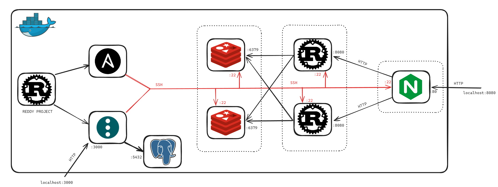
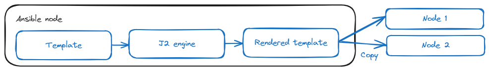
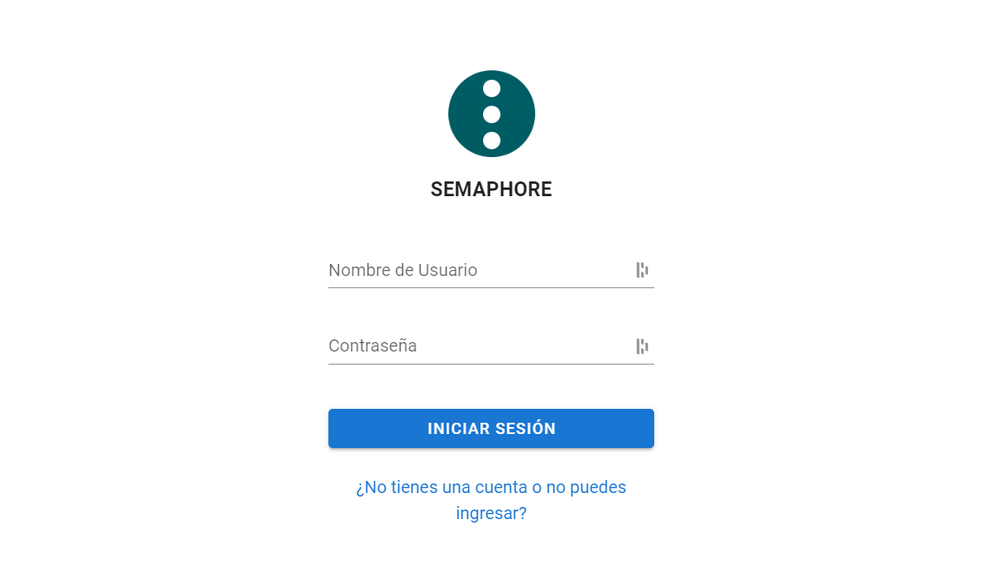
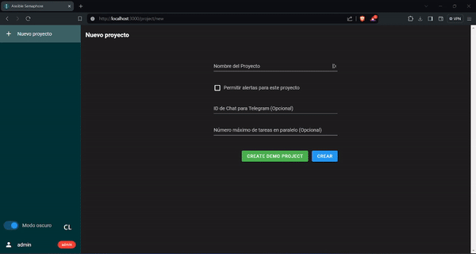
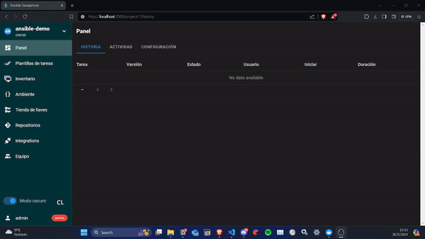
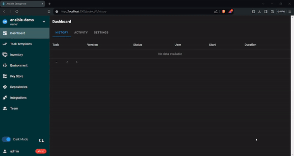
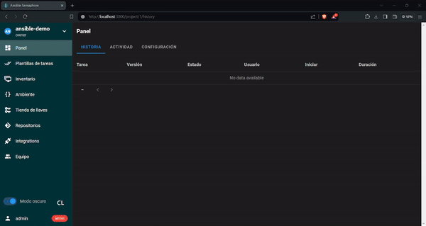
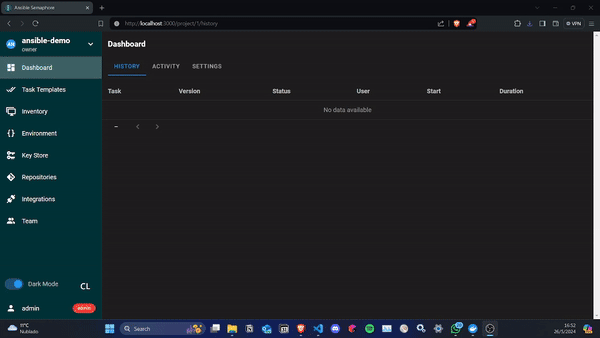
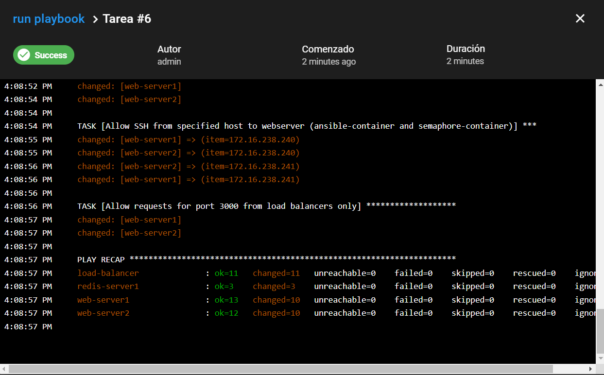

<h1 align="center" style="display: block; font-size: 2.5em; font-weight: bold; margin-block-start: 1em; margin-block-end: 1em;">
<a name="logo" href="https://docs.ansible.com/ansible/latest/index.html"></a>
  <br /><br /><strong>ANSIBLE DEMO</strong>
</h1>

<div align="center">
  
  
  
  
  
</div>

---

## Introduction

[Ansible](https://docs.ansible.com/ansible/latest/index.html) is an open-source IT automation tool that simplifies configuration management, application deployment, and infrastructure orchestration. It uses a simple declarative language based on YAML to describe the desired system configuration and automate complex tasks efficiently. Ansible is highly scalable and can manage everything from small single-server setups to large enterprise environments with thousands of nodes. Being agentless (unlike [Puppet](https://www.puppet.com/)), it doesn't require additional software on the target nodes, making deployment easy and reducing operational complexity.

## Table of contents[](#table-of-contents) 
- [Introduction](#introduction)
- [Table of contents](#table-of-contents)
- [Reddy](#reddy)
- [Docker installation ](#docker-installation-)
- [Inventory ](#inventory-)
  - [File structure](#file-structure)
    - [Host infomation](#host-infomation)
    - [Variables](#variables)
    - [Logical subgroups](#logical-subgroups)
- [Jinja 2 templates](#jinja-2-templates)
  - [Templating process](#templating-process)
  - [Usage of Jinja2 templates in this project](#usage-of-jinja2-templates-in-this-project)
- [Semaphore UI ](#semaphore-ui-)
- [Using Semaphore to run a playbook](#using-semaphore-to-run-a-playbook)

## Reddy[](#reddy)

Reddy is the system we will base our Ansible demonstration on. It consists of an [NGINX](https://nginx.org/en/) acting as a load balancer for two [Rust](https://www.rust-lang.org/)-based web servers. These servers store/retrieve a key in [Redis](https://redis.io/), and if it exists, return the associated value for that key. All of this is done using HTTP requests.

The system was set up using [Docker Compose](docker-compose.yaml), allowing us to conduct local testing and, ideally, add new containers for configuration with Ansible as needed. Each of the squares would represent a [Docker container](docker-containers). All containers belong to the same network, and the public key (id_rsa.pub) of the Ansible container is present in all containers to ensure seamless connections between them and enable task execution.

<div align="center">
    
</div>

<div align="right">[ <a href="#table-of-contents">↑ Back to top ↑</a> ]</div>

## Docker installation [](#docker-installation) 
In the root of the project, run docker compose (this will take a while).

```bash
$ docker-compose up -d
```

With this command, we are bringing up the aforementioned topology. However, before demonstrating it, before making any demonstration, we will provide an explanation of some concepts.

<div align="right">[ <a href="#table-of-contents">↑ Back to top ↑</a> ]</div>

## Inventory [](#inventory) 
In this section, we will explain the structure and purpose of the Ansible inventory file used in the project. An Ansible inventory file is a YAML or INI file that defines the hosts and groups of hosts upon which Ansible commands, modules, and playbooks operate. The inventory file for this project can be found [here](inventory.yml).

### File structure

#### Host infomation
- The `hosts` subsection lists individual hosts with their connection information
- Each host is defined with a name and connection details
- The `ansible_host` variable specifies the address Ansible should use to connect to the host

#### Variables 
- Although not shown in this specific inventory file, the `vars` subsection can be used to define variables that apply to all hosts within the `all` group.

#### Logical subgroups
  The `children` subsection groups hosts into logical subgroups, making it easier to manage and apply tasks to related hosts collectively. There are 3 groups in the inventory file:

- **Webserver Group**
  - The `webserver` group contains hosts related to web servers.
  - Hosts in this group:
    - `web-server1`
    - `web-server2`

- **Rediservers Group**
  - The `rediservers` group contains hosts related to Redis servers.
  - Hosts in this group:
    - `redis-server1`
    - `redis-server2`

- **Loadbalancer Group**
  - The `loadbalancer` group contains hosts related to load balancers.
  - Hosts in this group:
    - `load-balancer`

<div align="right">[ <a href="#table-of-contents">↑ Back to top ↑</a> ]</div>

## Jinja 2 templates

Ansible uses Jinja 2 templating to enable dynamic expressions and access variables and facts (parametrization).  This avoids hardcoding values inside templates

Usually templates are stores in the ```templates``` module. For example, you can create a template for a configuration file, then deploy that configuration file to multiple environments and supply the correct data (IP Address, hostname, version) for each environment.

All templating happens on the ansible control node before the task is sent and executed on the target machine. This approach minimize the package requirements on the target (Jinja 2 is only required in the control node). It also limits the amount of data Anislbe passes to the target machine.
It also limits the amount of data Ansible passes to the target machine. Ansible parses templates on the control node and passes only the information needed for each task to the target machine, instead of passing all the data on the control node and parsing it on the target.

### Templating process

The image illustrates the process of templating in Ansible using Jinja2:

<div align="center">
    
</div>

1. **Template**: The initial template file, typically stored in the `templates` directory.
2. **J2 Engine**: The Jinja2 templating engine processes the template file on the Ansible control node.
3. **Rendered Template**: The processed template with all variables and expressions evaluated and replaced.
4. **Copy**: The rendered template is then copied to the target nodes (e.g., Node 1 and Node 2) for execution.

### Usage of Jinja2 templates in this project

Below is an example of how Jinja2 is used to dynamically add web servers in the NGINX configuration file. This example demonstrates how you can use a Jinja2 template to iterate over a group of web servers and configure them for load balancing. This aproach allows to add new web servers without changing the templates, it is not necessary to know the server's IPs, nor how many of them are being used:

```jinja
upstream app_servers {
    
    server {{ hostvars[server]['ansible_host'] }}:8080 weight=1;
    
}

server {
    listen 80;

    location / {
        proxy_pass http://app_servers;
        proxy_set_header Host $host;
        proxy_set_header X-Real-IP $remote_addr;
        proxy_set_header X-Forwarded-For $proxy_add_x_forwarded_for;
        add_header X-Backend-Server $upstream_addr;
    }
}
```

In this template:

- In the `upstream app_servers` block servers are dynamically added from the `webserver` group.
- The `for` loop iterates over each server in the `webserver` group.
- `hostvars[server]['ansible_host']` is used to get the IP address of each server.
- The resulting configuration sets up load balancing for the NGINX server with the dynamically generated list of backend servers.

Jinja2 template is also used to configure the `REDIS_HOST` environment variable for a web server. This template is part of a larger Ansible task that sets up the environment for a web server:

```jinja
REDIS_HOST=redis://{{redis_hostname}}:6379
```

The Ansible playbook has the following task: 

```yml
- name: Create .env file
  ansible.builtin.template:
    src: ./templates/env.j2
    dest: /etc/reddy/.env
  vars:
    redis_hostname: redis-server1
```

When the task runs, Ansible processes the `env.j2` template and replaces the `{{ redis_hostname }}` placeholder with `redis-server1`.

<div align="right">[ <a href="#table-of-contents">↑ Back to top ↑</a> ]</div>

## Semaphore UI [](#semaphore) 

[Semaphore UI](https://www.semui.co/) is an open-source project offering a responsive web UI for running Ansible playbooks. It simplifies workflow management by allowing users to efficiently execute tasks, organize playbooks, and manage environments, inventories, repositories, and access keys. With its mobile-friendly interface, Semaphore provides flexibility in task management, enabling users to schedule playbook runs, access detailed logs, delegate tasks, and receive notifications.

## Using Semaphore to run a playbook

Let's run a playbook using Semaphore. The service its listening in http://localhost:3000/. 


<div align="center">
    
</div>

Login with the following credentials:

```bash
username = admin
password = admin
```

Now create a new project called `ansible-demo` like the GIF shows:
<div align="center">
    
</div>

Create a repository using the link of the repo like the GIF shows:
<div align="center">
    
</div>

Create ssh keys using the private key of the ansible-container. To get it:
```bash
$ docker exec -it ansible-container /bin/bash
root@23fa96265dde:/ansible cat /root/.ssh/id_rsa
```
Now paste it like the GIF shows:
<div align="center">
    
</div>

Create the inventory like the GIF shows:
<div align="center">
    
</div>

Create the environment like the GIF shows:
<div align="center">
    
</div>

Create the task like the GIF shows:
<div align="center">
    
</div>

Now run the task. This will be the expected result:
<div align="center">
    
</div>

<div align="right">[ <a href="#table-of-contents">↑ Back to top ↑</a> ]</div>
